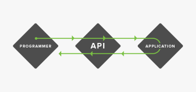
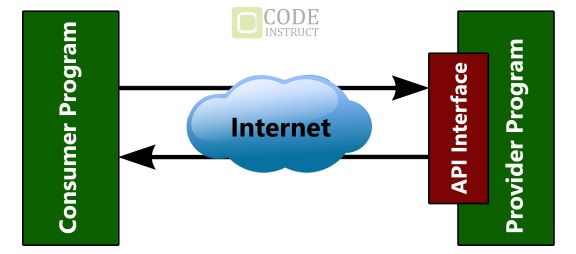
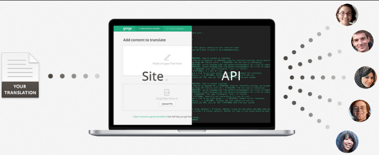

+++
date = "2017-01-03T23:48:56+05:30"
title = "What is an API?"
author = "Nishutosh"
+++

One question that confuses most of the people at the time they begin their developer career 
is "what the heck is an API?". This article is short explaination to "what's an API and why we need it".

Well , API stands for application programming interface , here the words that are given preference are 
application and interface , yes it's just a piece of code that works between two application to help them 
interact with each other. For example : Imagine you are in a restaurant , consider API to be the waiter/waitress , who takes your order to the chef and then brings the food that chef prepared for you. The waiter acts as an interface between you and the chef. 

Lets take another example , lets say you have a website that you coded on your own and you want google
maps to be embedded in your site , what will you do to get google maps service on your site? Show
your source code to google and wait for them to permit you to embed google maps in your site? Absolutely
no.You will interact with google maps API which will take your request and in response will provide you
with the maps.googlemaps API which acts as an interface between your source code and google maps.

Now lets discuss usefullness and other aspects of APIs.

First word that pop-up when API's are involved is "protocols". If I make a website and create an API for my site then I will have control of the data present on my site that I am sharing with other application that are trying to access the site. APIs are the guidelines between exchange of data from one program to another.I decide what to share and what not to.

This point also explains why API have a great hand in preventing ruthless web scraping.
Apart from API builder point of view API are the unsung heroes behind the worlds connectivity.
All sites in today's world interact with each other with API and give you the desired content , like 
trivago , an online hotel price comparison site makes a request of price of a hotel that you searched
to the APIs of all the travelling site , APIs of these travelling sites in response provide the prices of
that hotel to trivago and trivago simply assembles the responses from each of those sites and present it to you.

API saves time , well how , lets see. 
Firstly , when you visit a website the page is in HTML , two web application does not communicate with each other using HTML views , its for humans , well they talk in a language that's more convenient and faster to understand for them.
These maybe plain text , json format , xml etc. Most applications communicate with each other in json and XML which ultimately result in faster processing of data between two apps. 
Secondly , it's always cool to login different sites with your facebook/Google login details ,  well its all APIs running behind them. 

Well that's all , hope this help lots of developers to finally get into their mind "what's an API ? " , thanks for reading.